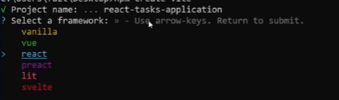

# Learning_Vitjs

# Create new Vite:

<details>

<summary> SEE </summary>

` npm create vite`



Instalar paqueteria de npm

`npm install`

`npm run dev`

</details>

# Comandos o abreviaciones

`rfce `
`imp` Luego tecla Tab

# Map

Estructura: 
* arreglo.map((task) => ( <br>
    __agregar codigo__ <br>
))

```
{tasks.map((task) => (
<div key={task.id}>
<h2>{task.title} </h2>
<p>{task.description} </p>
    </div>
))}
```

 # useEffect y useState: 

 <details>

<summary> See </summary>

```
function TaskList() {
  const [tasks, setTasks] = useState([]);//Definifimos tasks como un arreglo el cual estara vacio 

 //Usaremos useEffect para que llenar la constante tasks con los datos del arreglo "Tareas" al llamar a la funcion
  useEffect(() => {
    setTasks(Tareas);
  }, []);
}
```

**IMPORTANTE** evitar definir de la siguiente manera: const [tasks, setTasks] = useState(Tareas); => Error

 </details>

 # Copiar datos de un arreglo 

 **[...arreglo_a_copiar,datos_agregar]**

 ```
 const a = [1,2,3]
 const b = [...a,4,5,6]
 ```